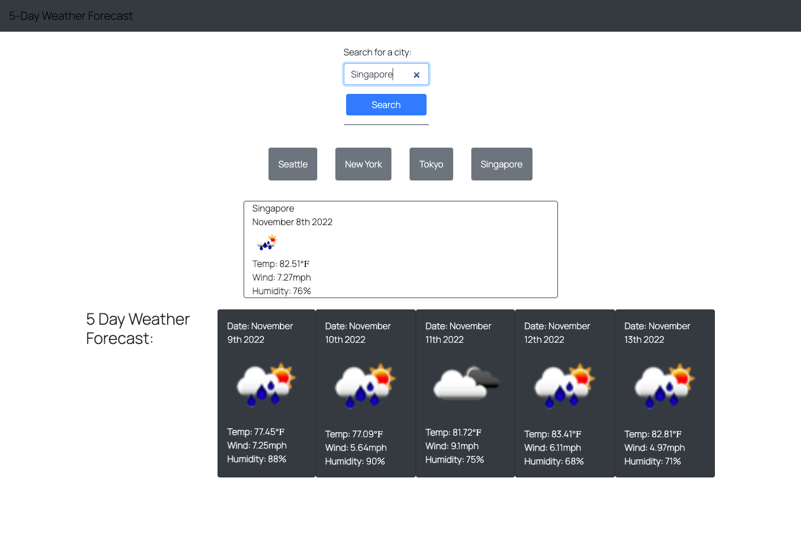

# Weather-Dashboard

## Description

This weather application was created for travelers. Those who travel wouldn like to see the weather of where they are traveling to so that they may bring the appropriate clothing.
This weather app allows the user to search any city in the world and will proved them with 
the current and upcoming five day forecasted weather. The app also saves the user's searches so that they may easily get back to it and view the forecast. 

Through building this application, I have learned how to use server side APIs and implement them with JavaScript to create a dynamic weather application.

## Installation

No installation required.

## Usage

Please follow this link for the [Weather Dashboard]
(https://carrieky04.github.io/Weather-Dashboard/)
    

    

## Credits

I watched these tutorials to further my understanding:

[This Tutorial](https://youtu.be/WZNG8UomjSI)

[This Tutorial](https://youtu.be/ecT42O6I_WI)

Stack Overflow

Following weather api was used to fetch data: 
(https://openweathermap.org/api)

## License

MIT License

Copyright (c) [year] [fullname]

Permission is hereby granted, free of charge, to any person obtaining a copy
of this software and associated documentation files (the "Software"), to deal
in the Software without restriction, including without limitation the rights
to use, copy, modify, merge, publish, distribute, sublicense, and/or sell
copies of the Software, and to permit persons to whom the Software is
furnished to do so, subject to the following conditions:

The above copyright notice and this permission notice shall be included in all
copies or substantial portions of the Software.

THE SOFTWARE IS PROVIDED "AS IS", WITHOUT WARRANTY OF ANY KIND, EXPRESS OR
IMPLIED, INCLUDING BUT NOT LIMITED TO THE WARRANTIES OF MERCHANTABILITY,
FITNESS FOR A PARTICULAR PURPOSE AND NONINFRINGEMENT. IN NO EVENT SHALL THE
AUTHORS OR COPYRIGHT HOLDERS BE LIABLE FOR ANY CLAIM, DAMAGES OR OTHER
LIABILITY, WHETHER IN AN ACTION OF CONTRACT, TORT OR OTHERWISE, ARISING FROM,
OUT OF OR IN CONNECTION WITH THE SOFTWARE OR THE USE OR OTHER DEALINGS IN THE
SOFTWARE.

---

